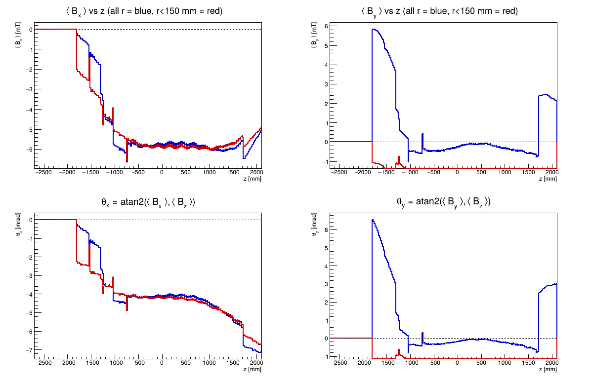
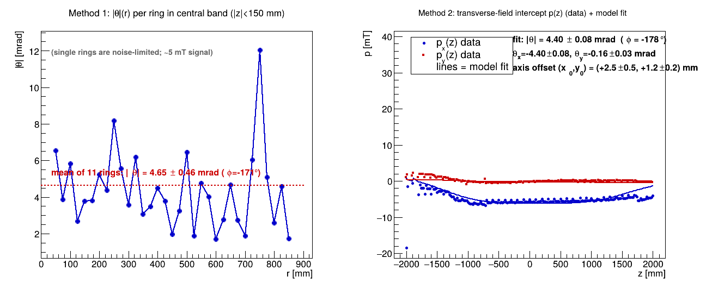

# sPHENIX Solenoid Field Map — CERN Mapping 2022-12-02

Analysis of the sPHENIX solenoid magnetic-field measurement from the CERN
mapping campaign (geometry-corrected point cloud, **2022-12-02**), together with
a direct comparison against the calculated **OPERA** field map used in sPHENIX
offline tracking.

This is a single, self-contained repository covering both the measured-map
analysis and the OPERA comparison. Going forward only two repositories are
relevant for the sPHENIX solenoid field:

- this repository — the **measured** map and its analysis, and
- [`haggerty/sphenixoperamaps`](https://github.com/haggerty/sphenixoperamaps) —
  the **calculated** (OPERA) map.

> ### Supersedes `sphenix-cernfinal-map`
> This repository replaces the earlier
> [`haggerty/sphenix-cernfinal-map`](https://github.com/haggerty/sphenix-cernfinal-map)
> and [`haggerty/cern-opera-comparison`](https://github.com/haggerty/cern-opera-comparison).
> Those used an earlier geometry correction (the `cernfinal`, 2022-11-10 CSVs)
> that contained a **~265 mm error in the surveyor→sPHENIX z position**. That
> placed the solenoid magnetic centre at z ≈ −240 mm and produced a spurious
> ~28 cm offset relative to OPERA. With the corrected 2022-12-02 point cloud the
> magnetic centre lands at **z ≈ +26 mm**, in agreement with OPERA (≈ +28.5 mm,
> the design coil offset). The
> old repositories should be considered archival.

## Data files (not stored in git)

The measurement CSVs (~43 MB) and the OPERA ROOT file are not committed. Place
them under `data/` (git-ignored) before running, e.g. as symlinks:

| File | Source |
|------|--------|
| `data/pointCloudFineFullField.csv`  | 2 cm step, 10° azimuthal, ~200 k points |
| `data/pointCloudRoughFullField.csv` | 10 cm step, 10° azimuthal, ~42 k points |
| `data/sphenix3dmapxyz.root`         | official OPERA map (see `sphenixoperamaps`) |

The measured CSVs come from the 2022-12-02 mapping tarball `download.tar`; on
SDCC the tarball and the unpacked CSVs are at
`/sphenix/data/data02/sphenix/MagnetMapping/cern_2022-12-02/`. The tarball
contains three maps (the analysis uses the two full-field ones):

| File in `download.tar` | Size | Description |
|------------------------|------|-------------|
| `pointCloudFineFullField.csv`  | 35.8 MB | full field, 2 cm step, 10° azimuthal (~200 k points) |
| `pointCloudRoughFullField.csv` |  7.5 MB | full field, 10 cm step, 10° azimuthal (~42 k points) |
| `pointCloudRoughHalfField.csv` |  7.5 MB | **half** field, 10 cm step, 10° azimuthal (not used here) |

**CSV format** (surveyor frame, mm and Tesla):

```
x_s, y_s, z_s, |B|, Bx_s, By_s, Bz_s
```

**Surveyor → sPHENIX transform** (applied in `sPHENIXFieldMap`):
`x_phx = x_s`, `y_phx = z_s`, `z_phx = −y_s`;
`Bx_phx = Bx_s`, `By_phx = Bz_s`, `Bz_phx = −By_s`.

**Measured extent** of the raw points, in sPHENIX coordinates (the data
coverage, distinct from the interpolation grid the loader builds):

| Map | points | x (mm) | y (mm) | z (mm) | r (mm) | φ |
|-----|-------:|--------|--------|--------|--------|---|
| `pointCloudFineFullField`  | ~200 k | −859 … 851 | −857 … 853 | −1784 … 2233 | 52 … 859 | full 360° |
| `pointCloudRoughFullField` | ~42 k  | −859 … 851 | −857 … 853 | −2192 … 2206 | 52 … 859 | full 360° |

- **Transverse:** cylinder of radius **~860 mm**, full azimuth, with a **central
  hole** — the smallest sampled radius is **~52 mm** (nothing is measured on axis).
- **Axial:** the fine map spans **z ≈ −1.78 … +2.23 m**; the rough map reaches
  ~400 mm further south (**z down to ≈ −2.19 m**). The rough map's only unique
  contribution is this −z (south) fringe tail below ≈ −1785 mm — elsewhere the
  fine map overrides it.

The OPERA map is a `TNtuple` named `fieldmap` with branches `x,y,z` (cm) and
`bx,by,bz` (T) on a uniform Cartesian grid.

## Repository layout

```
.
├── sPHENIXFieldMap.{h,cxx}   # field-map class: reads CSVs, phi-averages onto an
│                             #   (r,z) grid, enforces ∇·B = 0 for a consistent Br
├── analysis/
│   ├── checkFieldMap.C       # Bz(r,z), Br(r,z), ∇·B(r,z), Bz on axis; Maxwell check
│   ├── findCenter.C          # magnetic centre (Bz peak / Br sign change)
│   ├── checkAlignment.C      # solenoid-axis tilt vs sPHENIX z (global φ-averaged m=0)
│   └── estimateTilt.C        # two independent tilt estimators (near-axis + axis-line fit)
├── comparison/
│   ├── OperaMap.h            # shared OPERA loader/interpolator (grid read from ntuple)
│   ├── compareNewVsOpera.C   # quick overlays measured vs OPERA
│   ├── compareFieldMaps.C    # full m=0/m=1 Fourier comparison + Maxwell residuals
│   ├── findCenterOpera.C     # OPERA magnetic centre (same estimators as findCenter.C)
│   └── checkTilt.C           # azimuthal m=1 tilt signature from the raw CSVs
├── export/
│   └── makeMeasuredCartesianMap.C  # PHField3DCartesian drop-in ROOT file for reco
├── plots/                    # generated PDFs/PNGs (committed)
└── data/, output/            # git-ignored (inputs / large derived ROOT files)
```

All macros are run from the repository root and compiled with ACLiC (`+`); each
takes a data directory and/or output directory argument.

## How to run

```bash
# Field-map analysis                                      # plots written to plots/
root -l -b -q 'analysis/checkFieldMap.C+("data","plots")'   # -> fieldMap_overview.{pdf,png}
root -l -b -q 'analysis/findCenter.C+("data")'              # console only (centre estimators)
root -l -b -q 'analysis/checkAlignment.C+("data","plots")'  # -> fieldMap_alignment.{pdf,png}
root -l -b -q 'analysis/estimateTilt.C+("data","plots")'    # -> tilt_estimates.{pdf,png}

# OPERA comparison
root -l -b -q 'comparison/compareNewVsOpera.C+("data","data/sphenix3dmapxyz.root","plots")'  # -> compare_newVsOpera.{pdf,png}, compare_Br_z0.png
root -l -b -q 'comparison/compareFieldMaps.C+'          # default data/sphenix3dmapxyz.root; -> plots/01_…–11_…
root -l -b -q 'comparison/checkTilt.C+'                 # -> tilt_A…F_*.pdf (m=1 Bz maps/profiles)
root -l -b -q 'comparison/findCenterOpera.C+("data/sphenix3dmapxyz.root")'  # console only

# Drop-in Cartesian map for sPHENIX reconstruction
root -l -b -q 'export/makeMeasuredCartesianMap.C+'      # -> output/sphenix_measured_fieldmap_cartesian.root
```

Every plot in `plots/` is reproduced by re-running the macro listed above; the
three tilt estimators are intentionally kept as separate macros (see the
[tilt cross-checks](#cross-checks-three-independent-tilt-estimators)):
`checkAlignment.C` (global m=0), `estimateTilt.C` (near-axis + axis-line fit),
and `comparison/checkTilt.C` (m=1 Bz).

The `sPHENIXFieldMap` (r, z) grid is r ∈ [0, 900] mm (25 mm step, 37 nodes),
z ∈ [−2700, 2100] mm (20 mm step, 241 nodes); bilinear interpolation, Bφ = 0,
and Br derived from ∇·B = 0.

## Results

### Measured field map (2022-12-02)

| Quantity | Value |
|----------|-------|
| On-axis field, Bz(0,0,0)     | **1.397 T** |
| Peak on-axis Bz              | 1.3975 T |
| Magnetic centre (Br zero crossing) | **z ≈ +26 mm** |
| ∇·B residual (RMS / \|max\|) | 2.7 × 10⁻⁶ / 2.0 × 10⁻⁵ T/mm |
| Solenoid tilt \|θ\|          | ≈ 4.0–4.7 mrad toward −x (azimuth ≈ 176°); see [tilt cross-checks](#cross-checks-three-independent-tilt-estimators) |

### Comparison with OPERA

The official OPERA map (`sphenix3dmapxyz.root`, the `shiftby2p85cm` 28.5 mm
coil-offset default) is `81×81×101` over x,y ∈ [−80, 80] cm, z ∈ [−100, 100] cm.
The comparison window is the tracking volume (r ≤ 80 cm, |z| ≤ 100 cm).

| Quantity | Measured (2022-12-02) | OPERA |
|----------|-----------------------|-------|
| Magnetic centre (z) | ~+26 mm | ~+28.5 mm |
| Bz(0,0,0)           | 1.397 T | 1.385 T |
| Peak Bz             | 1.3975 T | 1.3848 T |

Both maps agree with each other and with the **28.5 mm design coil offset**
(`shiftby2p85cm`); see [Magnetic centre](#magnetic-centre) below for the
per-estimator values.

- **On-axis ΔBz(z=0) = −12.7 mT** (OPERA − measured): the measured central field
  is ~0.9 % higher than OPERA, a nearly uniform scale offset.
- **Max |ΔBz| = 13.9 mT**, **max |ΔBr| = 3.1 mT** over the tracking volume — no
  z-offset or shape disagreement, unlike the old `cernfinal` map.
- **Azimuthal (m=1) structure is small:** Bz m=1 amplitude ≤ 0.88 mT, with a
  consistent phase (Bφ m=1 phase 5.9 ± 0.8°), i.e. a single rigid-body
  tilt/offset direction rather than a winding asymmetry.
- **Maxwell residuals:** measured |∇·B| RMS = 0.003 mT/cm (enforced by
  construction) vs OPERA 45.9 mT/cm — the latter is the known artifact of storing
  Bx,By,Bz as three independent trilinear grids, not a defect of either map.

### Magnetic centre

On-axis Bz is flat to < 0.1 mT over several cm around the peak, so a plain
`argmax` on the field grid cannot localise the centre (on the 2 cm OPERA grid the
+20 and +40 mm nodes are equal to 1×10⁻⁶ T, so argmax reports +40 mm). The centre
must be found from the shape of the curve. `analysis/findCenter.C` (measured map)
and `comparison/findCenterOpera.C` (OPERA) report the same three robust estimators
plus the naive argmax for reference:

| Estimator | Measured (2022-12-02) | OPERA |
|-----------|-----------------------|-------|
| Bz argmax (grid-limited) | +20 mm ⚠️ | +40 mm ⚠️ |
| **Bz symmetry**          | **+27.0 mm** | **+31.0 mm** |
| **Parabola vertex**      | **+27.0 mm** | **+30.7 mm** |
| **Br zero crossing** (r = 100 mm) | **+25.8 mm** | **+32.2 mm** |

The three robust estimators agree within a few mm for each map, and both maps land
on the **28.5 mm design coil offset** — confirming the apparent measured-vs-OPERA
centre difference seen with `argmax` (+20 vs +40 mm) was an artifact, not physics.

```bash
root -l -b -q 'analysis/findCenter.C+("data")'
root -l -b -q 'comparison/findCenterOpera.C+("data/sphenix3dmapxyz.root")'
```

### Solenoid tilt: measured vs OPERA

A rigid tilt of the solenoid axis relative to the sPHENIX z axis shows up as a
non-zero **φ-averaged transverse field**: for a perfectly axial field the radial
component cancels in the azimuthal mean, so a residual ⟨B⊥⟩ ≈ |B|·θ measures the
tilt. `analysis/checkAlignment.C` computes this for the measurement; the same
calculation applied to the OPERA `TNtuple` (mean of `bx,by,bz` over the symmetric
Cartesian grid) gives the OPERA tilt.

| Map | \|tilt\| θ | direction | net ⟨B⊥⟩ |
|-----|-----------|-----------|----------|
| **Measured (2022-12-02)** | **4.13 mrad** (θx = −4.12, θy = +0.29); 4.0–4.7 with errors below | azimuth ≈ 176° (toward −x) | ⟨Bx⟩ ≈ −5.8 mT |
| **OPERA** (official `sphenix3dmapxyz.root`) | **≈ 0.02–0.05 mrad** | (chimney only) | ⟨Bx⟩,⟨By⟩ < 0.07 mT |

**The measured solenoid carries a real ~4 mrad axis tilt; OPERA does not.** OPERA
is an idealized calculation, axisymmetric apart from the chimney, so its residual
transverse field is two orders of magnitude smaller (and is just the chimney
breaking azimuthal symmetry). The measured tilt is a physical misalignment of the
magnet axis relative to the surveyor frame and **should be cross-checked against
the survey before being quoted** as a hardware number.

**Physical picture.** With the sPHENIX site convention (+z = north, +x = west,
y = up, so −x = east), θy ≈ 0 means the magnet is **level** (no pitch/roll); the
tilt is a pure horizontal yaw of ~4 mrad about the vertical axis, swinging the
**north end toward the east** (south end toward the west). The field follows the
axis: mostly north, canting slightly east (⟨Bx⟩ ≈ −6 mT eastward on the ~1.4 T
northward field). The ~4 mrad (≈ 0.23°) corresponds to ~6 mm of axis displacement
over a ~1.5 m half-length.

The same tilt appears as a small m=1 modulation of Bz: `comparison/checkTilt.C`
finds a mean m=1 Bz phase of ~7° in the central tracking region with amplitude
< 1 mT, and `compareFieldMaps.C` finds the OPERA−measured difference is dominated
by a single (m=1) direction (Bφ m=1 phase 5.9 ± 0.8°), i.e. a rigid-body
tilt/offset rather than a winding asymmetry.

> **Note — correction to the earlier comparison.** The retired
> `cern-opera-comparison` repo stated that *OPERA* contained a ~4.1 mrad dipole
> "toward −y" that was absent from the measurement. Measured against the **official**
> OPERA map (`sphenixoperamaps/sphenix3dmapxyz.root`) with the φ-averaged method
> above, OPERA shows **no** such tilt — it is the **measurement** that carries the
> ~4 mrad tilt. The old statement most likely referred either to a different,
> derived OPERA file (that analysis was hardwired to a 111³ `…trackingmapxyz.root`
> with an extra `hz` branch, not the official map) or to the m=1 phase of the
> *difference* rather than a tilt of OPERA itself.

#### Cross-checks: three independent tilt estimators

The φ-averaged method above (`checkAlignment.C`) volume-weights toward large
radius and gives a single global number. `analysis/estimateTilt.C` adds two
further estimators that use **physically distinct signatures** of the same rigid
tilt, so they fail in different ways — if all three agree, the tilt is real and
not an artefact of one method. All use only *measured* points (no r = 0
extrapolation through the field-map class).

**Method 1 — near-axis m=0 transverse field.** The φ-averaged transverse field
cancels the axisymmetric radial term and leaves ⟨B⊥⟩ ≈ θ·Bz at every radius, so
θ(r) should be flat for a rigid tilt. Per single ring it is **not** flat — it
scatters from 1.7 to 12 mrad because the ~5 mT transverse signal is comparable to
the ring-to-ring measurement noise (the innermost r = 50 mm ring alone gives a
spurious 6.6 mrad). Averaging the inner rings (r ≤ 300 mm, |z| < 150 mm) gives
**4.65 ± 0.46 mrad toward φ ≈ −171°**, where the error is the standard error of
the mean across the 11 independent rings — i.e. the ring-to-ring scatter is the
dominant *statistical* uncertainty (the larger systematic is discussed below).
This is the direct, least model-dependent estimate, and it confirms that a
*single* small volume at the centre is too noisy to trust.

**Method 2 — magnetic-axis line + tilt fit.** This separates a tilt from a pure
translation of the axis, which the φ-average alone cannot. Near the axis the
transverse field is the sum of a uniform tilt term and the solenoid focusing
field that points back toward the magnetic axis:

```
Bx(x,y,z) ≈ θx·B(z)  −  ½ B′(z)·( x − x_axis(z) ),   x_axis(z) = x0 + θx·z
```

with B′ = dBz/dz (and analogously for y). A per-z linear fit `Bx = px(z) + g(z)·x`
across the bore measures the focusing gradient `g(z) = −½B′(z)` and the intercept
`px(z)` at each z slab — driven by the fringe, where g is large, using real points
across the measured bore rather than an extrapolation to r = 0. A global
least-squares of the intercepts,

```
px(z) = θx·( B(z) − g(z)·z )  −  x0·g(z),
```

then solves for the tilt slope θx and the axis offset x0 simultaneously (likewise
θy, y0). Errors come from the least-squares covariance (residual variance × the
parameter covariance matrix). The fit gives **|θ| = 4.40 ± 0.08 mrad toward
φ ≈ −178°** (θx = −4.40 ± 0.08, θy = −0.16 ± 0.03 mrad) **plus a small transverse
axis offset (x0, y0) = (+2.6 ± 0.5, +1.2 ± 0.2) mm** at z = 0, i.e. the tilt and
the residual translation are disentangled.

Each estimator carries a statistical (internal-precision) error only:

| Estimator | \|θ\| [mrad] | direction φ | stat. error source (internal) |
|-----------|--------------|-------------|-------------------------------|
| `checkAlignment.C` — global φ-averaged m=0 | 3.99 ± 0.09 (4.13 point-weighted) | 176.2 ± 1.6° | spread of strong-field z-slices (\|Bz\|>1 T) |
| `estimateTilt.C` M1 — near-axis, mean of 11 rings (r ≤ 300 mm) | 4.65 ± 0.46 | −171 ± 6° | ring-to-ring standard error |
| `estimateTilt.C` M2 — axis-line fit | 4.40 ± 0.08 | −178.0 ± 0.3° | least-squares fit covariance |

All three land at **4.0–4.7 mrad in the −x direction** (θx ≈ −4.4 mrad, θy ≈ 0).

**The ± values above are statistical only and should not be read as the
uncertainty on a hardware tilt.** All three are *dispersion*-based (scatter across
z-slices, across rings, or about the fit model), so they measure only how
reproducibly *this* map pins down the field-to-frame rotation. The dominant
systematic — a probe/mapper/registration **yaw of the measurement frame** — is
**common-mode**: it adds the same offset to every slice, ring and z-slab, so it
contributes *exactly zero* to any of these dispersions. The error bars are
therefore structurally **blind** to the effect most likely to fake the signal;
they would read ~0.1 mrad even if a 4 mrad frame yaw produced the entire result
(field data cannot separate a magnet yaw from a measurement-frame yaw — see
[Systematics](#systematics-is-the-4-mrad-tilt-real)).

The realistic uncertainty hierarchy is:

| source | size | what it captures |
|--------|------|------------------|
| per-method statistical (above) | 0.1–0.5 mrad | random precision on this map |
| method-to-method spread | ~0.5 mrad | estimator dependence (3.99 / 4.40 / 4.65) |
| map-version spread | **~1.7 mrad** | 2.39 → 4.13 mrad across campaigns |
| frame-yaw degeneracy | up to ~100% | cannot be bounded from the map alone |

So the honest statement is: **measured field-to-frame angle ≈ 4.4 mrad (stat. ~0.1
mrad), with a systematic uncertainty of order the value itself — consistent with
the magnet being aligned to the survey's ~0.2 mrad.** The map establishes that a
~4 mrad rotation exists between field and nominal frame; it cannot by itself say
whether that rotation is the magnet, the probe, or the registration. The survey is
the decisive external check. (Of the three statistical errors, M1's ±0.46 is the
most trustworthy — ring-to-ring is genuinely semi-independent; M2's ±0.08 is
optimistic even statistically, since the p(z) residuals carry unmodelled
structure.) See `plots/tilt_estimates.{pdf,png}`.

### Systematics: is the ~4 mrad tilt real?

The estimators agree that a ~4 mrad rotation exists between the measured field and
the nominal (surveyor) frame. What they **cannot** establish is *what* is rotated.

**The fundamental degeneracy.** A rigid rotation of the *measuring system*
relative to the survey frame produces field data identical to rotating the
*magnet* by the same angle — `B_measured = R · B_true` looks the same whether `R`
came from the magnet yawing one way or the probe/mapper yawing the other. From the
field map alone, "magnet yawed east" and "probe yawed west" are indistinguishable.
The signal is also small in fractional terms: ⟨B⊥⟩ ≈ 6 mT on a 1.4 T field is
**0.4 %**, i.e. 4 mrad × 1.4 T — so a few-mrad error *anywhere* in the chain
reproduces it exactly.

**Candidate effects.**

| effect | scales with Bz? | degenerate with a true yaw? | notes |
|--------|:---:|:---:|-------|
| Probe-triad mounting rotation | yes | yes | a few-mrad mechanical misalignment leaks Bz into B⊥ |
| Mapper/gantry yaw vs. surveyed fiducials | yes | yes | whole field appears rotated |
| Fiducial / registration error | yes | yes | this program already had a 265 mm *z* survey error in the old map |
| Azimuthal rotation-stage tilt / readout offset | yes | yes | if the probe is spun in φ to sample azimuth |
| Probe transverse–axial cross-talk / non-orthogonality | yes | yes | planar Hall effect; ~4 mrad equiv. = whole signal |
| Mapping-arm deflection under magnetic force | yes | yes | field-dependent; absent in a magnet-off survey |
| External / ambient uniform field | **no** | no | disfavoured: ⟨B⊥⟩ tracks Bz, so not an additive offset |
| Coil winding asymmetry / displaced conductor | yes | no (real field) | a built-in transverse dipole, not an axis yaw; different z-dependence (the `checkTilt.C` m=1-vs-\|z\| test) |

**What points toward a measurement systematic rather than a hardware yaw:**

- **Map-to-map instability** — the tilt moved 2.39 → 4.13 mrad between map versions.
  A true hardware yaw should reproduce; a value that changes between campaigns
  points to something re-set between them (probe remount, re-registration).
- **The survey says ~0.17 mrad** mechanically (pending the new one) — two orders of
  magnitude smaller.
- **It is purely horizontal** (θy ≈ 0). Gravity-driven effects (cryostat/coil sag)
  would appear as a *vertical* pitch, not a horizontal yaw; a horizontal-only
  rotation is more naturally an installation/registration error about the vertical
  axis or a mapper yaw.
- **⟨B⊥⟩ ∝ Bz** through the plateau (θ roughly constant in z) — the signature of a
  rotation/cross-talk, which is what rules out an additive external field.

**Diagnostics that could actually disentangle it:**

- **The pending cryostat survey** — the only external handle that breaks the
  degeneracy. Decisive.
- **Current dependence** — if maps at different excitations exist: does ⟨B⊥⟩ scale
  linearly through zero with Bz (→ rotation / cross-talk / deflection) or carry a
  current-independent offset (→ external field)?
- **Reproducibility across a deliberate remount** — re-survey, re-mount, re-map; if
  the yaw changes, it lives in the measurement chain.
- **Probe calibration residual** — the transverse reading in a known pure-axial
  field gives the cross-talk floor directly.

> **Note.** Comparing the fine and rough scans is **not** an independent
> cross-check: the rough map was taken first in the *same campaign and setup* as
> insurance, so it shares the same probe alignment, mapper registration and any
> field-dependent deflection. Both inherit an identical frame yaw.

**Bottom line.** Treat the ~4 mrad as a rotation between field and frame whose most
likely home is the measurement chain. The magnet-yaws-east interpretation can be
neither confirmed nor excluded from the map alone; the survey is required.

### Drop-in replacement for reconstruction

`export/makeMeasuredCartesianMap.C` writes
`output/sphenix_measured_fieldmap_cartesian.root` — a `TNtuple` (`x:y:z:bx:by:bz:hz`,
cm/T) on the 111³ grid (±110 cm, 2 cm steps) used by `PHField3DCartesian`.
Points with r > 900 mm (cube corners, outside the measurement) are set to zero.
It is a drop-in replacement for the OPERA map: pointing `PHField3DCartesian` at
this file (with the default `magfield_rescale = 1.0`) delivers the measured field
to the tracking framework.

A prebuilt copy (111³, Bz(0,0,0) = 1.397 T) is on SDCC:

```
/sphenix/data/data02/sphenix/MagnetMapping/cern_2022-12-02/sphenix_measured_fieldmap_cartesian.root
```

## Plots

### Measured field overview


### Measured vs OPERA (overlays)


### Solenoid alignment (global m=0 transverse field vs z)


### Solenoid tilt estimators (near-axis + axis-line fit)


The `comparison/compareFieldMaps.C` macro additionally writes the numbered series
`plots/01_…`–`plots/11_…` (on-axis Bz, 2-D maps, ΔBz, Br comparison, m=1
amplitude/phase, Bφ, radial profiles, φ-dependence, ΔBz(φ=0 vs 180), Maxwell
residuals), and `comparison/checkTilt.C` writes the `plots/tilt_A…F_*.pdf` m=1
Bz maps and profiles.

## Dependencies

- [ROOT](https://root.cern) (developed with 6.40)
- The two large input files above (not distributed in git).
