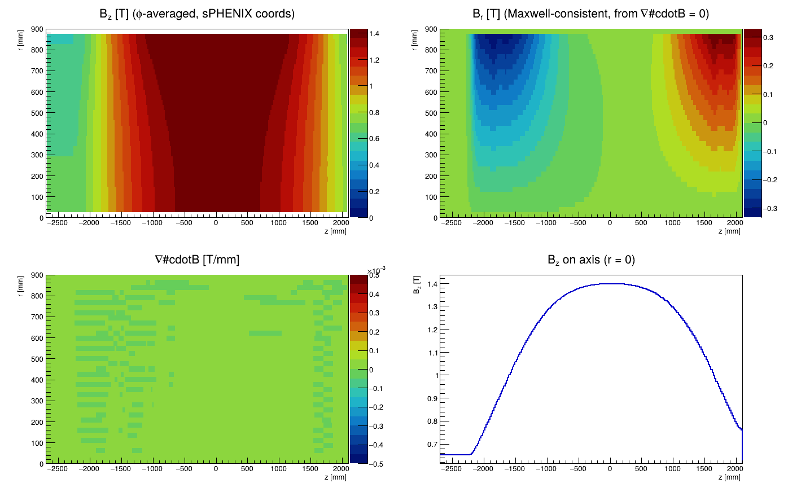
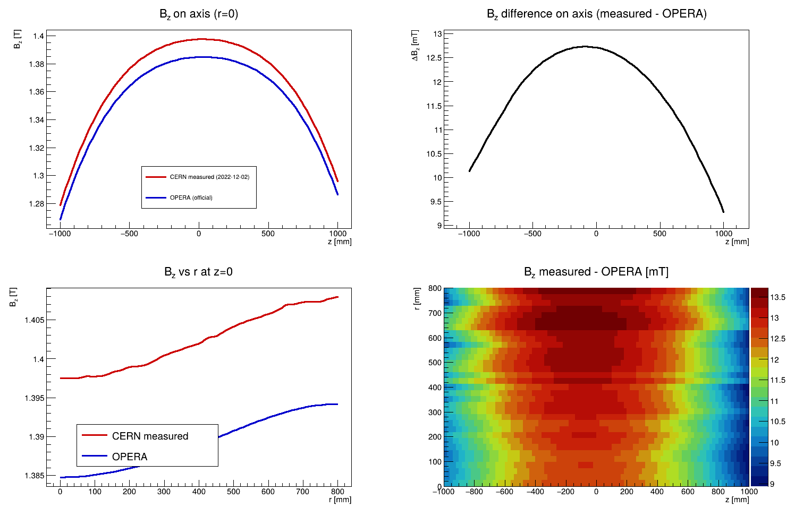

# sPHENIX Solenoid Field Map — CERN Mapping 2022-12-02

Analysis of the sPHENIX solenoid magnetic-field measurement from the CERN
mapping campaign (geometry-corrected point cloud, **2022-12-02**), together with
a direct comparison against the calculated **OPERA** field map used in sPHENIX
offline tracking.

This is a single, self-contained repository covering both the measured-map
analysis and the OPERA comparison. Going forward only two repositories are
relevant for the sPHENIX solenoid field:

- this repository — the **measured** map and its analysis, and
- [`haggerty/sphenixoperamaps`](https://github.com/haggerty/sphenixoperamaps) —
  the **calculated** (OPERA) map.

> ### Supersedes `sphenix-cernfinal-map`
> This repository replaces the earlier
> [`haggerty/sphenix-cernfinal-map`](https://github.com/haggerty/sphenix-cernfinal-map)
> and [`haggerty/cern-opera-comparison`](https://github.com/haggerty/cern-opera-comparison).
> Those used an earlier geometry correction (the `cernfinal`, 2022-11-10 CSVs)
> that contained a **~265 mm error in the surveyor→sPHENIX z position**. That
> placed the solenoid magnetic centre at z ≈ −240 mm and produced a spurious
> ~28 cm offset relative to OPERA. With the corrected 2022-12-02 point cloud the
> magnetic centre lands at **z ≈ +26 mm**, in agreement with OPERA (+40 mm). The
> old repositories should be considered archival.

## Data files (not stored in git)

The measurement CSVs (~43 MB) and the OPERA ROOT file are not committed. Place
them under `data/` (git-ignored) before running, e.g. as symlinks:

| File | Source |
|------|--------|
| `data/pointCloudFineFullField.csv`  | 2 cm step, 10° azimuthal, ~200 k points |
| `data/pointCloudRoughFullField.csv` | 10 cm step, 10° azimuthal, ~42 k points |
| `data/sphenix3dmapxyz.root`         | official OPERA map (see `sphenixoperamaps`) |

The measured CSVs come from the 2022-12-02 mapping tarball
(`cernmapping_2022-12-02/download.tar`); on SDCC they are also at
`/sphenix/data/data02/sphenix/MagnetMapping/cern_2022-12-02/`.

**CSV format** (surveyor frame, mm and Tesla):

```
x_s, y_s, z_s, |B|, Bx_s, By_s, Bz_s
```

**Surveyor → sPHENIX transform** (applied in `sPHENIXFieldMap`):
`x_phx = x_s`, `y_phx = z_s`, `z_phx = −y_s`;
`Bx_phx = Bx_s`, `By_phx = Bz_s`, `Bz_phx = −By_s`.

The OPERA map is a `TNtuple` named `fieldmap` with branches `x,y,z` (cm) and
`bx,by,bz` (T) on a uniform Cartesian grid.

## Repository layout

```
.
├── sPHENIXFieldMap.{h,cxx}   # field-map class: reads CSVs, phi-averages onto an
│                             #   (r,z) grid, enforces ∇·B = 0 for a consistent Br
├── analysis/
│   ├── checkFieldMap.C       # Bz(r,z), Br(r,z), ∇·B(r,z), Bz on axis; Maxwell check
│   ├── findCenter.C          # magnetic centre (Bz peak / Br sign change)
│   └── checkAlignment.C      # solenoid-axis tilt vs sPHENIX z
├── comparison/
│   ├── compareNewVsOpera.C   # quick overlays measured vs OPERA (grid-agnostic loader)
│   ├── compareFieldMaps.C    # full m=0/m=1 Fourier comparison + Maxwell residuals
│   └── checkTilt.C           # azimuthal m=1 tilt signature from the raw CSVs
├── export/
│   └── makeMeasuredCartesianMap.C  # PHField3DCartesian drop-in ROOT file for reco
├── plots/                    # generated PDFs/PNGs (committed)
└── data/, output/            # git-ignored (inputs / large derived ROOT files)
```

All macros are run from the repository root and compiled with ACLiC (`+`); each
takes a data directory and/or output directory argument.

## How to run

```bash
# Field-map analysis
root -l -b -q 'analysis/checkFieldMap.C+("data","plots")'
root -l -b -q 'analysis/findCenter.C+("data")'
root -l -b -q 'analysis/checkAlignment.C+("data","plots")'

# OPERA comparison
root -l -b -q 'comparison/compareNewVsOpera.C+("data","data/sphenix3dmapxyz.root","plots")'
root -l -b -q 'comparison/compareFieldMaps.C+'          # defaults to data/sphenix3dmapxyz.root
root -l -b -q 'comparison/checkTilt.C+'

# Drop-in Cartesian map for sPHENIX reconstruction
root -l -b -q 'export/makeMeasuredCartesianMap.C+'      # -> output/sphenix_measured_fieldmap_cartesian.root
```

The `sPHENIXFieldMap` (r, z) grid is r ∈ [0, 900] mm (25 mm step, 37 nodes),
z ∈ [−2700, 2100] mm (20 mm step, 241 nodes); bilinear interpolation, Bφ = 0,
and Br derived from ∇·B = 0.

## Results

### Measured field map (2022-12-02)

| Quantity | Value |
|----------|-------|
| On-axis field, Bz(0,0,0)     | **1.397 T** |
| Peak on-axis Bz              | 1.3975 T |
| Magnetic centre (Bz peak / Br zero) | **z ≈ +26 mm** |
| ∇·B residual (RMS / \|max\|) | 2.7 × 10⁻⁶ / 2.0 × 10⁻⁵ T/mm |
| Solenoid tilt \|θ\|          | 4.13 mrad (θx = −4.12, θy = +0.29 mrad; azimuth ≈ 176°) |

### Comparison with OPERA

The official OPERA map (`sphenix3dmapxyz.root`, the `shiftby2p85cm` 28.5 mm
coil-offset default) is `81×81×101` over x,y ∈ [−80, 80] cm, z ∈ [−100, 100] cm.
The comparison window is the tracking volume (r ≤ 80 cm, |z| ≤ 100 cm).

| Quantity | Measured (2022-12-02) | OPERA |
|----------|-----------------------|-------|
| Magnetic centre (z) | +26 mm | +40 mm |
| Bz(0,0,0)           | 1.397 T | 1.385 T |
| Peak Bz             | 1.3975 T | 1.3848 T |

- **On-axis ΔBz(z=0) = −12.7 mT** (OPERA − measured): the measured central field
  is ~0.9 % higher than OPERA, a nearly uniform scale offset.
- **Max |ΔBz| = 13.9 mT**, **max |ΔBr| = 3.1 mT** over the tracking volume — no
  z-offset or shape disagreement, unlike the old `cernfinal` map.
- **Azimuthal (m=1) structure is small:** Bz m=1 amplitude ≤ 0.88 mT, with a
  consistent phase (Bφ m=1 phase 5.9 ± 0.8°), i.e. a single rigid-body
  tilt/offset direction rather than a winding asymmetry.
- **Maxwell residuals:** measured |∇·B| RMS = 0.003 mT/cm (enforced by
  construction) vs OPERA 45.9 mT/cm — the latter is the known artifact of storing
  Bx,By,Bz as three independent trilinear grids, not a defect of either map.

### Solenoid tilt: measured vs OPERA

A rigid tilt of the solenoid axis relative to the sPHENIX z axis shows up as a
non-zero **φ-averaged transverse field**: for a perfectly axial field the radial
component cancels in the azimuthal mean, so a residual ⟨B⊥⟩ ≈ |B|·θ measures the
tilt. `analysis/checkAlignment.C` computes this for the measurement; the same
calculation applied to the OPERA `TNtuple` (mean of `bx,by,bz` over the symmetric
Cartesian grid) gives the OPERA tilt.

| Map | \|tilt\| θ | direction | net ⟨B⊥⟩ |
|-----|-----------|-----------|----------|
| **Measured (2022-12-02)** | **4.13 mrad** (θx = −4.12, θy = +0.29) | azimuth ≈ 176° (toward −x) | ⟨Bx⟩ ≈ −5.8 mT |
| **OPERA** (official `sphenix3dmapxyz.root`) | **≈ 0.02–0.05 mrad** | (chimney only) | ⟨Bx⟩,⟨By⟩ < 0.07 mT |

**The measured solenoid carries a real ~4 mrad axis tilt; OPERA does not.** OPERA
is an idealized calculation, axisymmetric apart from the chimney, so its residual
transverse field is two orders of magnitude smaller (and is just the chimney
breaking azimuthal symmetry). The measured tilt is a physical misalignment of the
magnet axis relative to the surveyor frame and **should be cross-checked against
the survey before being quoted** as a hardware number.

The same tilt appears as a small m=1 modulation of Bz: `comparison/checkTilt.C`
finds a mean m=1 Bz phase of ~7° in the central tracking region with amplitude
< 1 mT, and `compareFieldMaps.C` finds the OPERA−measured difference is dominated
by a single (m=1) direction (Bφ m=1 phase 5.9 ± 0.8°), i.e. a rigid-body
tilt/offset rather than a winding asymmetry.

> **Note — correction to the earlier comparison.** The retired
> `cern-opera-comparison` repo stated that *OPERA* contained a ~4.1 mrad dipole
> "toward −y" that was absent from the measurement. Measured against the **official**
> OPERA map (`sphenixoperamaps/sphenix3dmapxyz.root`) with the φ-averaged method
> above, OPERA shows **no** such tilt — it is the **measurement** that carries the
> ~4 mrad tilt. The old statement most likely referred either to a different,
> derived OPERA file (that analysis was hardwired to a 111³ `…trackingmapxyz.root`
> with an extra `hz` branch, not the official map) or to the m=1 phase of the
> *difference* rather than a tilt of OPERA itself.

### Drop-in replacement for reconstruction

`export/makeMeasuredCartesianMap.C` writes
`output/sphenix_measured_fieldmap_cartesian.root` — a `TNtuple` (`x:y:z:bx:by:bz:hz`,
cm/T) on the 111³ grid (±110 cm, 2 cm steps) used by `PHField3DCartesian`.
Points with r > 900 mm (cube corners, outside the measurement) are set to zero.
It is a drop-in replacement for the OPERA map: pointing `PHField3DCartesian` at
this file (with the default `magfield_rescale = 1.0`) delivers the measured field
to the tracking framework.

## Plots

### Measured field overview


### Measured vs OPERA (overlays)


The `comparison/compareFieldMaps.C` macro additionally writes the numbered series
`plots/01_…`–`plots/11_…` (on-axis Bz, 2-D maps, ΔBz, Br comparison, m=1
amplitude/phase, Bφ, radial profiles, φ-dependence, ΔBz(φ=0 vs 180), Maxwell
residuals) and `plots/tilt_*` from `checkTilt.C`.

## Dependencies

- [ROOT](https://root.cern) (developed with 6.40)
- The two large input files above (not distributed in git).
